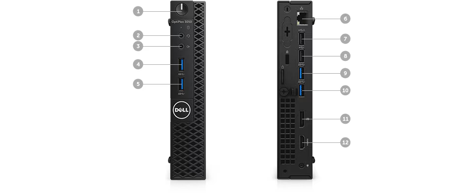

# 3050MFF

强大功能：围绕英特尔 ® 第 7 代 35W 处理器设计，可支持酷睿™ i5 。

高性能：支持高达 32GB 的 2400 MHz DDR4 内存（仅限第七代 CPU ），从而使画面更流畅并降低视觉闪动干扰。

增强信号：使用 802.11ac Wave 2 WiFi 提高了无线性能。将连接能力延伸到距离 WiFi 路由器更远的位置，提供更高的 WiFi 速度以实现更快的 数据 传输。

安全且流畅：通过充足的端口选项（包括 DisplayPort 、 HDMI 和可选的 VGA 端口或串行端口）提供无阻碍的数据传输和流畅的连接性，让您可以安心工作。

端口和插槽
1. 电源按钮 | 2.通用音频插孔 | 3.输出端口 | 4.USB 3.0端口 | 5.USB 3.0端口 | 6.有线网卡 | 7.USB 2.0端口 | 8.USB 2.0端口 | 9.USB 3.0端口 | 10.USB 3.0端口 | 11.DP | 12.HDMI*