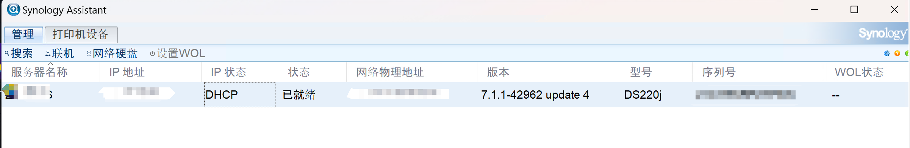
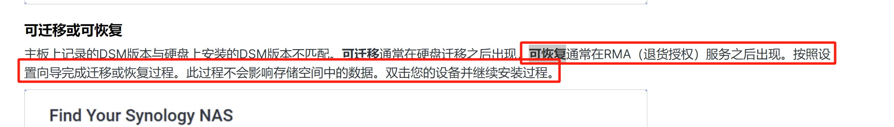

# 20241108-主板故障

今天下班突然发现nas不正常了，电源指示灯显示蓝色，一直闪烁。拆下硬盘后，直接通电，也显示蓝色并一直闪烁。
硬盘拆下来后，没有接入电脑，不清楚硬盘里的数据有没有问题。

## 20241108

### 群晖官网提交工单

登录群晖官网，提交工单，等待对方反馈。


### 申请某东售后
我的nas是23年4月在某东上购买的，2年的售后，所以还在保修期内。
于是在某东订单页面提交售后申请，描述了下问题，等待反馈。晚上8点半提交，9点就审核通过了，等待京东小哥上门。

## 20241109

### 京东上门收货

中午时候，小哥上来收货了。因为盒子已经扔了，所以直接给了裸机。

### 厂家收到货

当天下午厂家就收到nas了。

## 20241110

### 收到群晖技术支持答复

```text
工程师收到您的信息，想确认下，您关机状态下移除硬盘之后，空机开机，蓝色指示灯闪烁有没有超过30分钟？

如果超过30分钟了，那么可能是设备硬件问题。

我们将为您申请保外付费检测/维修，之后会有相关服务商电话联系您。关于维修价格和方式等相关问题，都可以电话中与其确认。
 
联系人：
电话：
所在地区：
公司名称（企业使用）：
 

希望以上信息对您有所帮助，谢谢。
```

30分钟应该是NAS系统初始化的最长时间了。

在官网技术支持页面告知了对方NAS已送修。

## 20241111

### 收到群晖售后反馈

群晖售后联系我，反馈我的nas的问题是主板引起的，他们换了一块板子，正在检测，如果没有问题，就可以寄出了。顺便问了下，主板的价格，他们没有回答。售后的点离得很近，这点倒是挺好的，不过还是得通过京东快递送过来，不能自取。

## 20241114

### 收货检验

收到货了。装上硬盘，开机蓝灯显示一会后，开始读取硬盘。指示灯平稳后，访问NAS局域网网址，发现打不开，猜测是IP地址变了。

下载[Synology Assist](https://www.synology.cn/zh-cn/support/download/DS220j?version=7.2#utilities)，点击搜索，显示下面截图，当时的状态不是已就绪，是可恢复。



官网搜索文档后，发现有[相关说明](https://kb.synology.cn/zh-cn/DSM/tutorial/What_device_statuses_shared_between_SynologyAssistant_WebAssistant#x_anchor_id10)



Synology Assist上有个恢复按钮，点击后，进入恢复过程。具体过程忘记了。

恢复完成后，用新的IP能访问到NAS页面了。

**主板更换后，nas的序列号和以前的不一样**

至此说明nas硬件已经修复了。使用时遇到了2个问题，[nas存储池降级](/hardware/synology/using/disk-broken)和[存储池容量过低](/hardware/synology/using/low-storage-space)