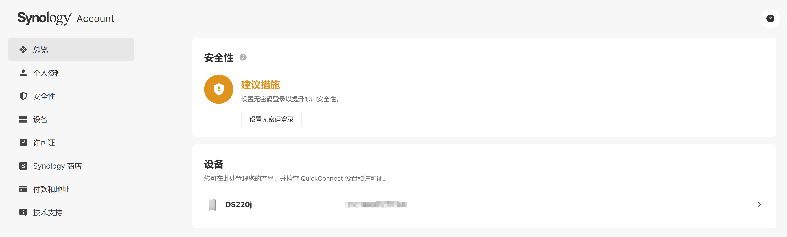
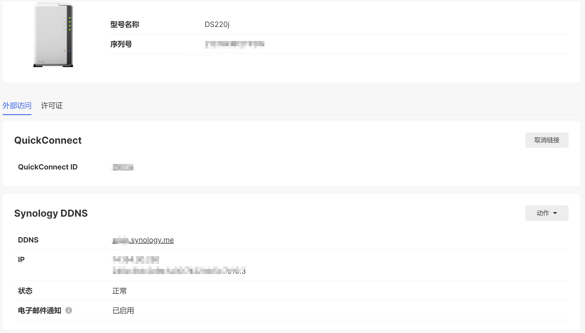
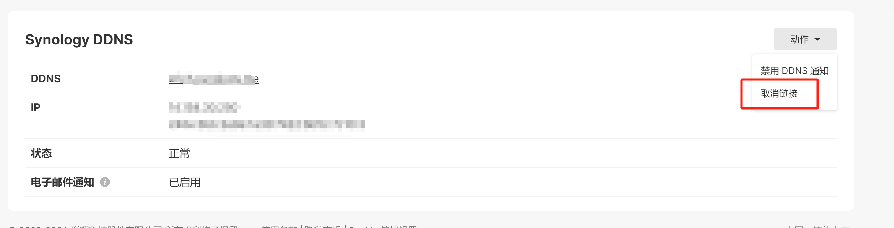

# DDNS注册失败

收到修好后的nas后，解决了告警，接下来要重新设置下DDNS。

## 发现问题

在外部访问->DDNS页面，编辑Synology供应商记录，配置IPv6，点击测试联机后，返回失败，密码不正确。

```text
System failed to register [xxxxx] to [xxx.synology.me] in DDNS server [Synology] because of [Authentication failed].
```

按字面意思理解，是密码不对，但DSM我已经在使用了，群晖官网我也能正常登录，不应该报这个错误。

## 群晖个人页面设备信息

不过在使用官网个人页面的过程中，注意到设备这里的数据，当时是有两条的。一条是坏的主板，另一条是现在的主板。看到这个，我才意识到我的nas的序列号变了。


进入设备详情页，里面有DDNS信息。


## 尝试再次注册

然后我又再次编辑，还是同样的报错。于是我把DDNS删除了，重新创建。创建的时候，发现主机名称输入我之前的id后，测试联机变成灰色（不太确定）。

我试着分析了一下：我的nas的序列号变了，域名绑定在老的nas序列号，我现在要把域名绑定到新序列号，也就是先要把老序列号和域名的关联去掉。群晖的设备详情页面有这个按钮。取消后，再次注册，还是相同的报错。


## DSM登录群晖用户

意外发现DSM的控制面板里，左下角有个Synology账户，成功登录后，再次注册DDNS，成功。
