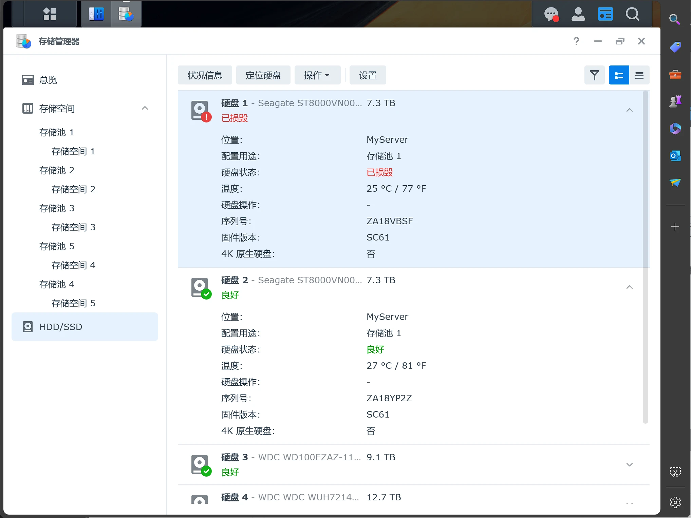

# 硬盘已损毁

我的NAS安装了两个硬盘，组成了Raid1。

 - 西部数据（WD） NAS硬盘 WD Red Plus 西数红盘 4TB CMR 5400转 256MB SATA 私有云
 - 希捷（SEAGATE）NAS硬盘 4TB 256MB 5400转 CMR垂直 网络存储 SATA 希捷酷狼 机械硬

打开存储管理器，看到类似下面的页面

::: tip
这是网上的图片
:::

提示已损毁的磁盘是西数硬盘。Raid1是复制模式，两块盘的数据是一样的，所以数据应该是没有问题的。

我打开File Station，打开了一些文件，确认了文件是正常的。

然后，开始处理，先是网上搜索了一遍，网友反馈停用硬盘。考虑数据有备份，就照做了。

1. 停用硬盘。停用后，nas不在滴滴叫唤了。
2. 重启nas。重启后，nas识别到西数硬盘
3. 将硬盘重新加入到存储池1，等待nas自行复制数据到西数硬盘。

第二天看数据已经同步好了，状态也都正常了。
