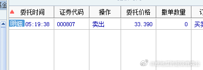

回复@一变万物变:都要看，结合消息面，昨晚伦铝大涨，昨日K线中阳回落，所以今天延续涨势出中大阳的概率很大，
//@一变万物变:老舅，短线的话，您看60分钟布林轨线？还是看7其他的多？我一直看的日线[泪][泪]
//@挖地瓜的超级鹿鼎公:回复@酸酸酸菜魚dd:很仔细，给你点个赞，今天早上没开盘之前看到的上轨是33.11，要去上轨，至少涨4%，如果假设涨4%，上轨会升3-4毛，大致在33.4--33.5，所以安全的33.4，减少1分钱，所以埋伏33.39，避免整数关卡，确保成交
//@酸酸酸菜魚dd:60分钟上轨不是33.11吗
//@挖地瓜的超级鹿鼎公:回复收起

