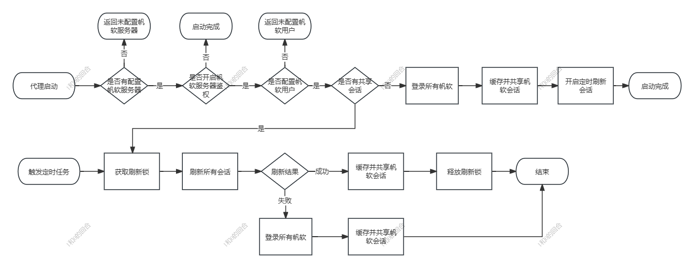
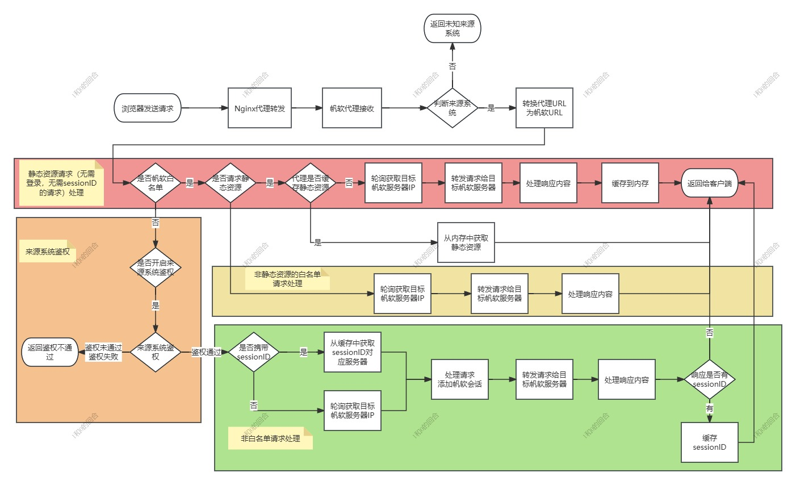

# 帆软代理的设计

1. 请求转发。代理要转发请求到帆软服务器。如果请求携带了sessionID，代理要转发给生成该sessionID的帆软服务器上。
2. 请求和响应的包装。代理要包装帆软的请求，修改帆软的响应，尤其是响应里的URL。因为响应内容会到达客户端浏览器，从浏览器到代理的过程中，URL会被修改，导致帆软的URL失效，所以响应内容里的URL要根据不同来源系统进行修改。
3. 会话管理。代理要维护帆软集群的会话，定时延长会话的有效期。
4. 同时支持多个第三方系统。代理要识别请求的来源系统，并调用来源系统的鉴权接口，实现外部系统的鉴权。
5. 负载均衡。代理可以对接Kubernetes、Nginx等负载均衡器，实现集群的负载均衡。
6. 没有其他依赖。不使用数据库，不使用redis，不使用其他中间件。这个难度有点大。

## 代理会话管理

## 代理处理流程

代理处理流程如下：

处理流程主要分为几个部分。

### 静态资源处理

帆软的静态资源通常是用以下5个请求路径来访问的：

- [http://domain/webroot/decision/view/report?op=emb&resource=xxx.css](http://domain/webroot/decision/view/report?op=emb&resource=xxx.css)
- [http://domain/webroot/decision/view/report?op=resource&resource=/com/fr/web/core/xxx](http://domain/webroot/decision/view/report?op=resource&resource=/com/fr/web/core/xxx)
- [http://domain/webroot/decision/view/report?op=toolbar_icon&id=toolbar-image.png](http://domain/webroot/decision/view/report?op=toolbar_icon&id=toolbar-image.png)
- [http://domain/webroot/decision/v1/cloud/file?resource=xxxx.js](http://domain/webroot/decision/v1/cloud/file?resource=xxxx.js)
- [http://domain/webroot/decision/file?path=xx/xx](http://domain/webroot/decision/file?path=xx/xx)

这5个请求，都不需要帆软会话和sessionID，因此不需要来源系统鉴权，只要能识别来源系统，就可以处理。

有些静态资源的尺寸比较大，比如js，有20多K ，如果每次都从帆软服务器上下载，会增加网络延迟，同时返回的静态资源通过gzip的方式压缩，减少网络传输的数据量，所以代理服务器会在内存中缓存gzip压缩后的资源数据。

因为来源系统的URL不同，返回给客户端的静态文件也不同，所以缓存的静态资源要和来源系统绑定。

### 动态资源处理

A: 客户端发送请求到代理。
B: 代理接收请求。
C: 判断请求是否携带了 sessionID。
D: 如果请求携带了 sessionID，代理将请求转发到生成该 sessionID 的帆软服务器。
E: 如果请求没有携带 sessionID，代理选择一个可用的帆软服务器进行转发。
F: 帆软服务器处理请求并返回响应。
G: 代理对响应进行包装，特别是修改响应中的 URL。
H: 客户端接收响应。
这个流程图展示了帆软代理的主要工作流程，包括请求转发、会话管理和响应包装等关键步骤。
