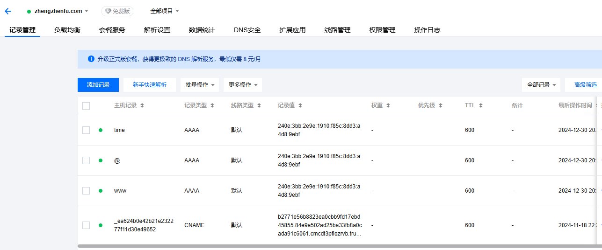

# DNS

DNS是Domain Name System（域名系统）的缩写，是一种将域名和IP地址进行映射的技术。它使得用户可以通过记忆易记的域名来访问互联网上的资源，而不需要记住复杂的IP地址。

## DNS说明

DNS解析是在一个二级域名

在DNSPod里，查看记录是以下内容

在Cloudfare里，查看记录是以下内容

每行有名称、记录类型、内容这三个关键字段。不同的记录类型，填写内容会有所不同。例如，A记录填写的是IP地址，CNAME记录填写的是另一个域名等。

### DNS名称

DNS记录中的名称字段是域名的子域名部分，例如在example.com中，www.example.com中的www就是名称字段。如果记录类型为根域名，则名称字段为空。

如果DNS名称是@，则表示该记录是根域名的记录，例如example.com中的example就是@。

## DNS记录类型

DNS 记录类型定义记录的用途或功能，如域名解析、电子邮件路由、管理信息或 Cloudflare 服务记录配置。
常见的DNS记录类型有A记录、AAAA记录、CNAME记录、MX记录、NS记录、TXT记录、SRV记录、SOA记录和PTR记录。

### A记录

A记录（Address Record）是将域名映射到IPv4地址的一种记录类型。当用户访问一个域名时，DNS服务器会返回与该域名关联的IPv4地址。例如，在example.com中，www.example.com的A记录可能指向192.0.2.1，此时的DNS记录名称是www

### AAAA

AAAA记录（Quad-A Record）是将域名映射到IPv6地址的一种记录类型。当用户访问一个域名时，DNS服务器会返回与该域名关联的IPv6地址。例如，在example.com中，www.example.com的AAAA记录可能指向2001:db8::1。

### CNAME

CNAME记录（Canonical Name Record）是将一个域名映射到另一个域名的一种记录类型。当用户访问一个域名时，DNS服务器会返回与该域名关联的另一个域名。例如，在example.com中，www.example.com的CNAME记录可能指向example.com。

### MX记录

MX记录（Mail Exchange Record）是将一个域名映射到邮件服务器的一种记录类型。当用户发送电子邮件到一个域名时，DNS服务器会返回与该域名关联的邮件服务器地址。例如，在example.com中，mail.example.com的MX记录可能指向mailserver1.example.com和mailserver2.example.com。

### NS记录

NS记录（Name Server Record）是将一个域名映射到DNS服务器的一种记录类型。当用户访问一个域名时，DNS服务器会返回与该域名关联的DNS服务器地址。例如，在example.com中，ns1.example.com和ns2.example.com的NS记录可能指向example-dns-server1.com和example-dns-server2.com。
