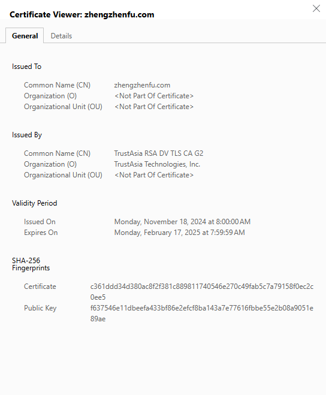
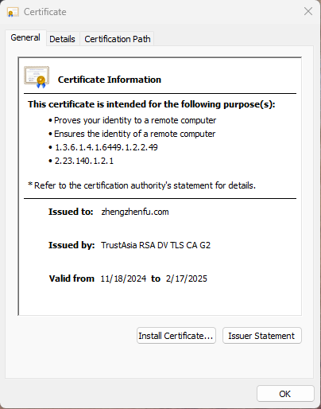
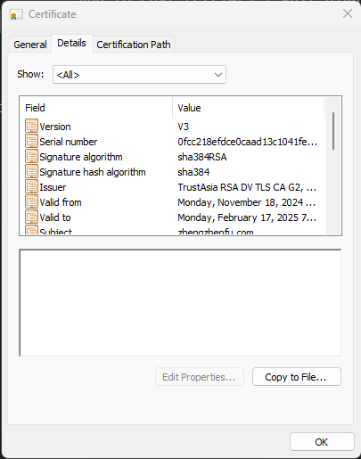
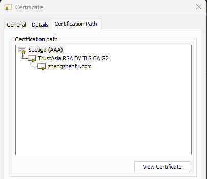

# 证书

证书是一种电子文件，用于证明某个实体的身份或权利。证书通常由证书颁发机构（CA）签发，并包含公钥、私钥和相关信息。

<!--  -->

## 通用信息

将浏览器的https证书导出成crt文件后，双击打开，可以看到以下内容：

第一段指出该证书的目的：

- 验证您的身份给远程计算机
- 确保远程计算机的身份

第二段是CA机构的声明

该证书由[TrustAsia]公司签发，授予[zhengzhenfu.com]，有效期为[2024-11-18]至[2025-2-17]。

TrustAsia是一家CA机构，其根证书被广泛信任。CA的具体内容可以看[CA证书](/security/certification/certification_authority)

## 详细信息

第二个tab是详细信息，可以看到该证书的公钥、私钥等信息。

### Version 1 Field Only

|字段|值|
|----|-----|
|Version|V3|
|Serial Number|0fcc218efdce0caad13c1041fee86a74|
|Signature Algorithm|sha384RSA|
|Signature hash algorithm|sha384|
|Issuer|CN = TrustAsia RSA DV TLS CA G2, O = TrustAsia Technologies, Inc., C = CN|
|Valid from|Monday, November 18, 2024 8:00:00 AM|
|Valid to|Monday, February 17, 2025 7:59:59 AM|
|Subject|zhengzhenfu.com|
|Public key|30 82 01 0a 02 82 01 01 00 dc d7 62 76 d9 5e 6e 51 56 f8 d2 71 40 34 bb 8c 56 03 c2 b5 4d 60 b2 74 79 a6 be 4d f7 4f c5 01 6a 0d 5a db 1e 0f 35 de 86 43 55 7e fd 35 fe b8 ec 07 ae 7c b8 f8 4e ca a0 5c 2b 35 1f 04 1c 21 76 c1 41 fb 91 8a 80 63 c8 4b 5c 61 ff 6b 75 35 f9 ec f6 b2 22 1e 83 0c ad d2 19 5e 1e 69 d6 95 df 94 df d9 b8 fa c0 4c ee fa c7 32 73 60 5e 0e f6 e2 a5 fc 0b c3 04 6b c8 6f 58 53 15 c8 b8 d1 8e 7d 22 51 9a 39 fd 11 1b ce 8c b4 b5 f5 85 51 c8 9a 14 a3 61 15 2a fc ba 7b d9 d1 24 fb 41 09 13 94 a6 3f b0 6b 04 90 82 b6 e0 32 c5 80 f1 72 91 c6 0e d7 0e bd 8a ef 1a 0c ad 68 86 15 76 85 64 e7 f4 63 a7 42 67 5d 25 90 d2 f6 77 46 1e 9e 7a 2e a6 e8 f6 1e a1 8c 80 9f 07 b4 f7 0a 86 e3 4c a1 6b 68 9d 82 c5 ac 8c a8 44 06 5b 6d f0 c5 f5 f6 e5 40 ee 28 10 cc c4 2c 7d 2b 9b 99 a9 15 02 03 01 00 01|
|Public key parameters|05 00|

### Extension Only

#### Authority key Identifier

KeyID=5f3a7c11107e0c677161dc8ba3b5000367f5571c

#### Subject key Identifier

62cd436f623f9e3cd27c4c3c79e2c3b4a22805b5

#### Enhanced Key Usage

Server Authentication (1.3.6.1.5.5.7.3.1), Client Authentication (1.3.6.1.5.5.7.3.2)|

#### Certificate Policies

[1]Certificate Policy:
     Policy Identifier=1.3.6.1.4.1.6449.1.2.2.49
     [1,1]Policy Qualifier Info:
          Policy Qualifier Id=CPS
          Qualifier:
               https://sectigo.com/CPS
[2]Certificate Policy:
     Policy Identifier=2.23.140.1.2.1

#### Authority Information Access

[1]Authority Info Access
     Access Method=Certification Authority Issuer (1.3.6.1.5.5.7.48.2)
     Alternative Name:
          URL=http://crt.trust-provider.cn/TrustAsiaRSADVTLSCAG2.crt
[2]Authority Info Access
     Access Method=On-line Certificate Status Protocol (1.3.6.1.5.5.7.48.1)
     Alternative Name:
          URL=http://ocsp.trust-provider.cn

#### SCT List

v1
cf1156eed52e7caff3875bd9692e9be91a71674ab017ecac01d25b77cecc3b08
‎Monday, ‎November ‎18, ‎2024 10:27:35 PM
SHA256
ECDSA
304402207f8947ade3e949388ca5841fa0780faf883c8cdd537701c36bb6d6fe08498a960220041fe213818acb59a2e1009c0fd73eed8680b096a0b2fe9d039d3ea8d39fc14b

v1
ccfb0f6a85710965fe959b53cee9b27c22e9855c0d978db6a97e54c0fe4c0db0
‎Monday, ‎November ‎18, ‎2024 10:27:35 PM
SHA256
ECDSA
304402202cddae10a0dcbb09f926a38477db9e0c0435cd484fce907728eb1f75c488e5c00220663601333b64e092b1a63fc609ff451f75e93c6398327c6fc1082b1d9f99d4f0

#### Subject Alternative Names

DNS Name=zhengzhenfu.com
DNS Name=www.zhengzhenfu.com

#### Key Usage

Digital Signature, Key Encipherment (a0)

#### Basic Constraints

Subject Type=End Entity
Path Length Constraint=None

#### Thumbprint

a6fd23f52326db6dcc9535ef9e3a4e1065aeaf5c

## 证书链

证书是由根证书颁发机构（Sectigo(AAA)）生成根证书，然后由根证书签发下一级证书。只有是信任的根证书颁发机构（Sectigo(AAA)）才能验证证书的有效性。其他的机构签发的证书都是不被认可的。在浏览器的URL左侧如果是红色的，就说明HTTPS证书是非根证书机构签发的。

当前的证书是由以下证书链验证的：

1. 根证书：Sectigo(AAA)
2. 中间证书：TrustAsia
3. 用户证书：zhengzhenfu.com

